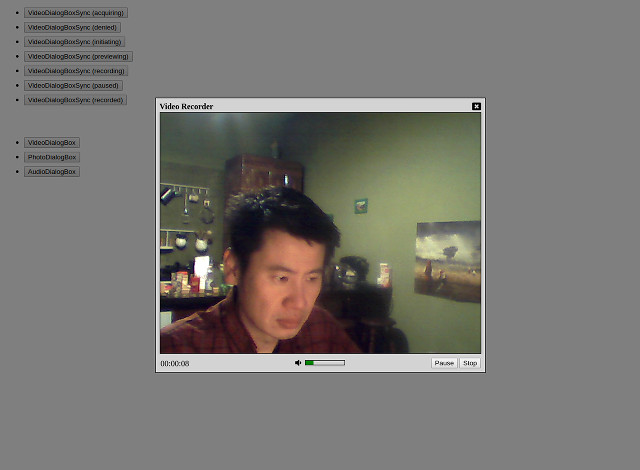

Relaks Media Capture Example
============================

In [previous examples](https://github.com/trambarhq/relaks#examples), we had used [Relaks](https://github.com/trambarhq/relaks) to facilitate the retrieval of remote data. In this example we're going to do something different. We're going to build a component that captures video through a webcam. It's meant to demonstrate that Relaks can be used to solve a broad range of problems. It'll also yield a reusable library that we can employ in future projects.

One way to think of Relaks is that it is React with time. Whereas `render()` produces a picture, `renderAsync()` produces an animation, composed of multiple pictures appearing at different points in time. When we use Relaks to render a page progressively, we're really creating an animation that looks as follows:

* Frame 1: Message indicating the page is loading
* Frame 2: Page with 60% of the data it needs
* Frame 3: Page with 85% of the data
* Frame 4: Page with 100% of the data

For our video capturing component, we'd create something like this:

* Frame 1: Placeholder graphic while waiting for the user to grant permission to use camera
* Frame 2: Input from camera 1
* Frame 3: Input from camera 2 (after the user made the switch)
* Frame 4: Changes to the UI indicating recording has commenced (after the user pressed the **Start** button)
* Frame 5: Duration changes to `00:01`
* Frame 6: Duration changes to `00:02`
*  ...
* Frame 64: Duration changes to `01:00`
* Frame 65: The recorded video (after the user pressed the **Stop** button)

This animation runs for a bit longer, naturally. It's also non-linear: The user can affect how it unfolds. Conceptually though, it's not at all different from what we've been creating so far. Meanwhile, the details concerning input devices and video compression will get shoved into a [separate reusable class](https://github.com/trambarhq/relaks-media-capture).

## Live Demo

You can see the example in action [here](https://trambar.io/examples/media-capture/). It's little more than two lists of buttons. Those in the first list bring up the synchronous part of the video dialog in various states, with video files used as stand-in for camera input. Those in the second list activate the fully functional asynchronous components, wired up to a real camera.

Note: `VideoDialogBox` and `AudioDialoBox` will not work in Safari or Edge due to the lack of support for media recording.

[](https://trambar.io/examples/media-capture/)

## Getting Started

To see the code running in debug mode, first clone this repository. In the working folder, run `npm install`. Once that's done, run `npm run dev` to launch [WebPack Dev Server](https://webpack.js.org/configuration/dev-server/). Open a browser window and enter `http://localhost:8080` as the location.

Run `npm run dev-https` if you wish to see the example in a phone or a tablet. Either Chrome or Firefox permits the use of the camera in an insecure page (unless the server is localhost). WebPack Dev Server therefore needs to use HTTPS. The browser will still regard the page as suspect. You'll need to confirm that you really want to go there.

## Relak Media Capture

Implementation details concerning input devices and video compression are encapsulated in [relaks-media-capture](https://github.com/trambarhq/relaks-media-capture). The library makes use of the following browser features:

* [Media Stream API](https://developer.mozilla.org/en-US/docs/Web/API/Media_Streams_API) is used to capture video.
* [MediaStream Recording API](https://developer.mozilla.org/en-US/docs/Web/API/MediaStream_Recording_API) is used to encode video files.
* The [toBlob()](https://developer.mozilla.org/en-US/docs/Web/API/HTMLCanvasElement/toBlob) or [toDataURL()](https://developer.mozilla.org/en-US/docs/Web/API/HTMLCanvasElement/toDataURL) method of `HTMLCanvasElement` is used to save snapshots.
* [Web Audio API](https://developer.mozilla.org/en-US/docs/Web/API/Web_Audio_API) is used to monitor audio volume.
* [`devicechange`](https://developer.mozilla.org/en-US/docs/Web/API/MediaDevices) events of are monitored to detect change in device availability.
* [`orientationchange`](https://developer.mozilla.org/en-US/docs/Web/Events/orientationchange) events are monitored in order to deal with rotation of a camera in a phone or tablet.
* [`ended`](https://developer.mozilla.org/en-US/docs/Web/Events/ended) events are monitored in case a camera is unplugged during recording.

## VideoDialogBox

```javascript
import React, { useMemo, useEffect, useCallback } from 'react';
import Relaks, { useProgress } from 'relaks';
import RelaksMediaCapture from 'relaks-media-capture';
import { LiveVideo } from 'live-video';
import { constrainSize } from 'utils';

async function VideoDialogBox(props) {
    const { onClose, onCapture } = props;
    const [ show ] = useProgress();
    const capture = useMemo(() => {
        return new RelaksMediaCapture({
            video: true,
            audio: true,
            preferredDevice: 'front',
            watchVolume: true,
        });
    }, []);

    const handleStart = useCallback((evt) => {
        capture.start();
        capture.snap();
    });
    const handleStop = useCallback((evt) => {
        capture.stop();
    });
    const handlePause = useCallback((evt) => {
        capture.pause();
    });
    const handleResume = useCallback((evt) => {
        capture.resume();
    });
    const handleClear = useCallback((evt) => {
        capture.clear();
    });
    const handleDeviceChange = useCallback((evt) => {
        capture.choose(evt.target.value);
    });
    const handleCancel = useCallback((evt) => {
        if (onClose) {
            onClose({});
        }
    });
    const handleAccept = useCallback((evt) => {
        const { capturedVideo, capturedImage } = capture;
        if (onCapture) {
            onCapture({
                video: {
                    blob: capturedVideo.blob,
                    width: capturedVideo.width,
                    height: capturedVideo.height,
                    duration: capturedVideo.duration,
                },
                image: {
                    blob: capturedImage.blob,
                    width: capturedImage.width,
                    height: capturedImage.height,
                },
            });
        }
        capture.deactivate();
        handleCancel();
    });

    useEffect(() => {
        capture.activate();
        return () => {
            capture.deactivate();
        };
    }, []);

    do {
        render();
        await capture.change();
    } while (capture.active);

    function render() {
        show(
            <div className="overlay">
                <div className="dialog-box video">
                    {renderTitle()}
                    {renderViewport()}
                    {renderControls()}
                </div>
            </div>
        );
    }

    function renderTitle() {
        return (
            <div className="title">
                Video Recorder
                <i className="fa fa-window-close" onClick={handleCancel} />
            </div>
        );
    }

    function renderViewport() {
        const { status, liveVideo } = capture;
        const classNames = [ 'video-viewport', status ];
        const size = constrainSize(liveVideo, { width: 320, height: 240 });
        return (
            <div className={classNames.join(' ')} style={size}>
                {renderVideo(size)}
            </div>
        );
    }

    function renderVideo(size) {
        const { status, liveVideo, capturedVideo, capturedImage } = capture;
        switch (status) {
            case 'acquiring':
                return (
                    <span className="fa-stack fa-lg">
                        <i className="fa fa-video fa-stack-1x" />
                    </span>
                );
            case 'denied':
                return (
                    <span className="fa-stack fa-lg">
                        <i className="fa fa-video fa-stack-1x" />
                        <i className="fa fa-ban fa-stack-2x" />
                    </span>
                );
            case 'initiating':
                return <LiveVideo muted />;
            case 'previewing':
            case 'capturing':
            case 'paused':
                return <LiveVideo srcObject={liveVideo.stream} style={size} muted />;
            case 'captured':
                return <video src={capturedVideo.url} poster={capturedImage.url} style={size} controls />;
        }
    }

    function renderControls() {
        return (
            <div className="controls">
                {renderDuration() || renderDeviceMenu()}
                {renderVolume()}
                {renderButtons()}
            </div>
        )
    }

    function renderDeviceMenu() {
        const { devices, chosenDeviceID } = capture;
        if (!devices || devices.length <= 1) {
            return <div className="devices" />;
        }
        return (
            <div className="devices">
                <select onChange={handleDeviceChange} value={chosenDeviceID}>
                    {devices.map(renderDeviceMenuOption)}
                </select>
            </div>
        );
    }

    function renderDeviceMenuOption(device, i) {
        const label = device.label.replace(/\([0-9a-f]{4}:[0-9a-f]{4}\)/, '');
        return <option value={device.id} key={i}>{label}</option>;
    }

    function renderDuration() {
        const { duration } = capture;
        if (duration === undefined) {
            return null;
        }
        const seconds = duration / 1000;
        const hh = Math.floor(seconds / 3600).toString().padStart(2, '0');
        const mm = Math.floor(seconds / 60 % 60).toString().padStart(2, '0');
        const ss = Math.floor(seconds % 60).toString().padStart(2, '0');
        return <div className="duration">{`${hh}:${mm}:${ss}`}</div>
    }

    function renderVolume() {
        const { status, volume } = capture;
        if (volume === undefined || status === 'captured') {
            return <div className="volume" />;
        }
        const iconClassNames = [ 'fa' ];
        if (volume > 40) {
            iconClassNames.push('fa-volume-up');
        } else if (volume > 10) {
            iconClassNames.push('fa-volume-down');
        } else {
            iconClassNames.push('fa-volume-off');
        }
        const barClassNames = [ 'volume-bar', status ];
        const barStyle = { width: volume + '%' };
        return (
            <div className="volume">
                <i className={iconClassNames.join(' ')} />
                <div className="volume-bar-frame">
                    <div className={barClassNames.join(' ')} style={barStyle} />
                </div>
            </div>
        );
    }

    function renderButtons() {
        const { status } = capture;
        switch (status) {
            case 'acquiring':
            case 'denied':
            case 'initiating':
            case 'previewing':
                return (
                    <div className="buttons">
                        <button onClick={handleCancel}>Cancel</button>
                        <button onClick={handleStart} disabled={status !== 'previewing'}>Start</button>
                    </div>
                );
            case 'capturing':
                return (
                    <div className="buttons">
                        <button onClick={handlePause}>Pause</button>
                        <button onClick={handleStop}>Stop</button>
                    </div>
                );
            case 'paused':
                return (
                    <div className="buttons">
                        <button onClick={handleResume}>Resume</button>
                        <button onClick={handleStop}>Stop</button>
                    </div>
                );
            case 'captured':
                return (
                    <div className="buttons">
                        <button onClick={handleClear}>Retake</button>
                        <button onClick={handleAccept} disabled={status !== 'captured'}>Accept</button>
                    </div>
                );
        }
    }
}

const component = Relaks.memo(VideoDialogBox);

export {
    component as VideoDialogBox,
};
```

The capturing process starts with a status of `acquiring`, when we ask the browser for permission to use the camera. If the user choose not to grant permission, the status changes to `denied`. Otherwise the status becomes `initiating`, which last only a brief moment before it changes to `previewing`. At this point the video stream is available and we can show the user what the camera is seeing.

When the user clicks the **Start** button, the status changes to `capturing`. If he clicks the **Pause** button at some point, the status would change to `paused`. A click on **Resume** would change it back to `capturing`.

When the user finally clicks the **Stop** button, the status becomes `captured`.

The prop `liveVideo` contains a [`MediaStream`](https://developer.mozilla.org/en-US/docs/Web/API/MediaStream) object. It represents the live input from the camera. When attached to a `<video />` as its [`srcObject`](https://developer.mozilla.org/en-US/docs/Web/API/HTMLMediaElement/srcObject), the element will show the video feed. `liveVideo` will change when the user select a different camera. It could also change when the user rotate the device.

`capturedVideo` and `capturedImage` are the end results of the media capturing operation. The latter is used as a video element's "poster".

`volume` is a number between 0 and 100 indicating the strength of audio coming from the microphone. It's depicted in a gauge so the user knows his voice is being picked up.

`duration` is the video length in millisecond. It's available only when the status is `capturing`, `captured`, or `paused`.

`devices` is a list of cameras that the user's computer is equipped with. It can change when the user plug in a new device. `chosenDeviceID` is the ID of the selected device.

Let us look at the component's `render()` method. It's fairly simple. It delegates most of its functionalities to other methods:

```javascript
/* ... */
```

`renderTitle()` is fairly boring. It just draws a `div` with some text and an icon:

```javascript
/* ... */
```

`renderViewport()` is responsible for the component's main contents. It draws a container `div` and calls another method to render the video itself:

```javascript
/* ... */
```

What `renderVideo()` produces depends on the current status:

```javascript
/* ... */
```
We draw some placeholder graphics when we don't have yet the live video feed. Once we have it we show that until we have captured a video.

`LiveVideo` ([`live-video.jsx`](https://github.com/chung-leong/relaks-media-capture-example/blob/master/src/live-video.jsx)) doesn't do anything aside from rendering a `video` element. It's a workaround for React's inability to set an element's `srcObject`.

The live video needs to be muted to avoid audio feedback.

Because the resolution of the camera could be larger than size of the browser, we need to impose a size on the video element so the dialog box does not spill out. The calculation is done in `getDerivedStateFromProps()`:

```javascript
/* ... */
```

The method that draws the controls aren't particularly interesting:

```javascript
/* ... */
```

On the left side of the dialog box we have either the duration or device selection menu. The volume indicator sits in the center, while the buttons are on the right. Methods for rendering these parts are shown below:

```javascript
/* ... */
```

`onClose` is called when the dialog box should close. `onCapture` is called after a video is captured. Simple.

In the constructor we create an instance of `RelaksMediaCapture`. This object will deal with the particulars of video recording.

```javascript
```

We want to record both audio and video, with the front-facing camera as the preferred source. We also want the object to monitor the audio volume.


At first glance this loop might seem disconcerting. It seems like a newbie mistake to wait for change to occur in a loop. Due to JavaScript's single-threaded nature, such a loop would cause the browser to lock up--in normal synchronous code. We're dealing with asynchronous code here, however, so the loop is perfectly okay. Babel will magically transform it into proper callback-style JavaScript.

The usefulness of the loop would be more apparent if we imagine that other actions will take place after we've captured the video. Suppose we want to upload the video to the server. We would handle that in the following manner:

```javascript
    do {
        render();
        await capture.change();
    } while (capture.active);

    uploader.queue(capture.capturedVideo.blob);
    uploader.queue(capture.capturedImage.blob);
    uploader.activate();
    do {
        render();
        await uploader.change();
    } while(uploader.active);
```

Now suppose that after uploading the file, we need to wait for the video to be transcoded. Every few seconds we want to ask the server how much progress it has made. Doing so would be fairly straight forward:

```javascript
async renderAsync(meanwhile) {
    do {
        render();
        await capture.change();
    } while (capture.active);

    uploader.queue(capture.capturedVideo.blob);
    uploader.queue(capture.capturedImage.blob);
    uploader.activate();
    do {
        render();
        await uploader.change();
    } while(uploader.active);

    const { transcodingProgressURL } = uploader.result;
    let transcodingProgress = 0;
    while (transcodingProgress < 100) {
        transcodingProgress = await fetch(transcodingProgressURL);
        render();
        await delay(3000);
    };
```

As you can see, the use of loops allows us to easily slot in addition steps. The imperative coding style makes the program flow much more obvious.

## Taking Photo

Letting a user take a picture of himself is probably a more common feature in web applications than video capturing. We can easily accomplish that by stripping down `VideoDialogBox`. `PhotoDialogBox` ([photo-dialog-box.jsx](https://github.com/chung-leong/relaks-media-capture-example/blob/master/src/photo-dialog-box.jsx)) is the result.

## Final Thoughts

I hope this example has lent you some new insights into Relaks. As was said earlier, Relaks is React wih time. It lets you tap into the power of ES7 async/await, a feature that greatly simplifies management of asynchronous operations.

In an future example, we're going to implement the file uploader that appeared in our hypothetical code. Stay tuned!
