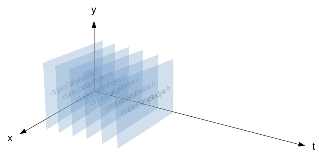

Relaks Media Capture Example
============================

In [previous examples](https://github.com/trambarhq/relaks#examples), we used [Relaks](https://github.com/trambarhq/relaks) to facilitate retrieval of remote data. In this example we're going to do something different. We're going to build a component that captures video through a webcam. It's meant to demonstrate that Relaks can be used to solve a broad range of problems. It'll also yield a reusable library that we can employ in future projects.

One way to think of Relaks is that it's React with time added. Where as `render()` produces a picture, `renderAsync()` produces an animation, composed of multiple pictures appearing at different points in time. When we use Relaks to render a page progressively, we're actually creating an animation that looks as follows:

* Frame 1: Message indicating the page is loading
* Frame 2: Page with 60% of the data it needs
* Frame 3: Page with 85% of the data
* Frame 4: Page with 100% of the data

For our video capturing component, we'd create something like this:

* Frame 1: Placeholder graphic while wanting for the user to grant permission to camera
* Frame 2: Input from camera 1
* Frame 3: Input from camera 2 (after the user made the switch)
* Frame 4: Changes to the UI indicating recording has commenced (after the user pressed the **Start** button)
* Frame 5: Duration changes to `00:01`
* Frame 6: Duration changes to `00:02`
*  ...
* Frame 64: Duration changes to `01:00`
* Frame 65: The recorded video (after the user pressed the **Stop** button)

This animation runs for a bit longer, naturally. It's also non-linear. The user can change how it unfolds. Conceptually though, it's not at all different from what we've been creating so far. We're going to employ the same strategy as before: create a regular React component that handles the visual aspects and a Relaks component that handles with the temporal aspects.

Meanwhile, the details concerning with camera management and video encoding will get shoved into a [separate reusable class](https://github.com/trambarhq/relaks-media-capture).

## Live Demo

You can see the example in action [here](https://trambar.io/examples/media-capture/). It's little more than a list of buttons. The first seven brings up the synchronous component in various state, with video files as stand-in for camera input. The last button brings up the asynchronous component, wired up to a real camera.


## Getting Started

To see the code running in debug mode, first clone this repository. In the working folder, run `npm install`. Once that's done, run `npm run start` to launch [WebPack Dev Server](https://webpack.js.org/configuration/dev-server/). Open a browser window and enter `http://localhost:8080` as the location.

Run `npm run start-https` if you wish to see the example in a different device. Either Chrome or Firefox permit the use of the camera in an insecure page (unless the server is localhost). Therefore WebPack Dev Server needs to employ HTTPS. The browser will still regard the page as suspect. You'll need to confirm that you really want to go there.

## VideoDialogBoxAsync

The example was built in a sort of backward fashion. `VideoDialogBoxSync` was coded first with the help of dummy props. Once the user interface was finished and the set of necessary props was established, `VideoDialogBox` was written, which supplies these props to its synchronous partner. The code that actually deals with video recording was written last.

Let us first examine `VideoDialogBoxSync` ([video-dialog-box.jsx](https://github.com/chung-leong/relaks-media-capture-example/blob/master/src/video-dialog-box.jsx#L111)). Its `propTypes` are listed below:

```javascript
VideoDialogBoxSync.propTypes = {
    status: PropTypes.oneOf([
        'acquiring',
        'denied',
        'initiating',
        'previewing',
        'capturing',
        'paused',
        'captured',
    ]),
    liveVideo: PropTypes.shape({
        stream: PropTypes.instanceOf(MediaStream).isRequired,
        width: PropTypes.number.isRequired,
        height: PropTypes.number.isRequired,
    }),
    capturedVideo: PropTypes.shape({
        url: PropTypes.string.isRequired,
        blob: PropTypes.instanceOf(Blob).isRequired,
        width: PropTypes.number.isRequired,
        height: PropTypes.number.isRequired,
    }),
    capturedImage: PropTypes.shape({
        url: PropTypes.string.isRequired,
        blob: PropTypes.instanceOf(Blob).isRequired,
        width: PropTypes.number.isRequired,
        height: PropTypes.number.isRequired,
    }),
    volume: PropTypes.number,
    duration: PropTypes.number,
    devices: PropTypes.arrayOf(PropTypes.shape({
        id: PropTypes.string,
        label: PropTypes.string,
    })),
    selectedDeviceID: PropTypes.string,

    onChoose: PropTypes.func,
    onCancel: PropTypes.func,
    onStart: PropTypes.func,
    onStop: PropTypes.func,
    onPause: PropTypes.func,
    onResume: PropTypes.func,
    onClear: PropTypes.func,
    onAccept: PropTypes.func,
}
```

The capturing process starts with a status of `acquiring`, when we ask the browser for permission to use the camera. If the user choose not to grant permission, the status changes to `denied`. Otherwise the status becomes `initiating`, which last only a brief moment, before it changes to `previewing`. At this point the video stream is available and we can show the user want he's about to capture.

When the user clicks the **Start** button, the status changes to `capturing`. If he clicks the **Pause** button at some point, the status would change to `paused`. A click on **Resume** changes the status back to `capturing`.

When the user finally clicks the **Stop** button, the status becomes `captured`.

The prop `liveVideo` contains a [`MediaStream`](https://developer.mozilla.org/en-US/docs/Web/API/MediaStream) object. It's used to show the live input from the camera. `liveVideo` will change when the user select a different camera. It could also change when the user rotate the device.

`capturedVideo` and `capturedImage` are the end results of the media capture operation. The latter is used as the video element's "poster".

`volume` is a number between 0 and 100 indicating the strength of audio from the microphone. It's depicted in a gauge so that the user knows his voice is being picked up.

`duration` is the video length in millisecond. It's available only when the status is `capturing`, `captured`, or `paused`.

`devices` is a list of cameras that the user's device is equipped with. It can change when the user plug in a new device. `selectedDeviceID` is the ID of the selected device.

Let us look at the component's `render()` method. It's fairly simple. It delegates most of its functionalities to other methods:

```javascript
render() {
    return (
        <div className="overlay">
            <div className="dialog-box video">
                {this.renderTitle()}
                {this.renderViewport()}
                {this.renderControls()}
            </div>
        </div>
    );
}
```

`renderTitle()` is fairly boring. It just draws a `div` with some text:

```javascript
renderTitle() {
    let { onCancel } = this.props;
    return (
        <div className="title">
            Video Recorder
            <i className="fa fa-window-close" onClick={onCancel} />
        </div>
    );
}
```

`renderViewport()` is responsible for the component's main contents. It draws a container `div` and calls another method to render the video itself:

```javascript
renderViewport() {
    let { status } = this.props;
    let { viewportWidth, viewportHeight } = this.state;
    let style = {
        width: viewportWidth,
        height: viewportHeight,
    };
    let className = `video-viewport ${status}`;
    return (
        <div className={className} style={style}>
            {this.renderVideo()}
        </div>
    );
}
```

What `renderVideo()` produces depends on the current status:

```javascript
renderVideo() {
    let { status, liveVideo, capturedVideo, capturedImage } = this.props;
    let { viewportWidth, viewportHeight } = this.state;
    let videoStyle = {
        width: viewportWidth,
        height: viewportHeight,
    };
    switch (status) {
        case 'acquiring':
            return (
                <span className="fa-stack fa-lg">
                    <i className="fa fa-video fa-stack-1x" />
                </span>
            );
        case 'denied':
            return (
                <span className="fa-stack fa-lg">
                    <i className="fa fa-video fa-stack-1x" />
                    <i className="fa fa-ban fa-stack-2x" />
                </span>
            );
        case 'initiating':
            return <LiveVideo muted />;
        case 'previewing':
        case 'capturing':
        case 'paused':
            return <LiveVideo srcObject={liveVideo.stream} style={videoStyle} muted />;
        case 'captured':
            return <video src={capturedVideo.url} poster={capturedImage.url} style={videoStyle} controls />;
    }
}
```
We draw some placeholder graphics when we don't have the live video feed. Once we have it we show what the camera is seeing, until we have captured a video.

`LiveVideo` ([`live-video.jsx`](https://github.com/chung-leong/relaks-media-capture-example/blob/master/src/live-video.jsx)) doesn't do anything aside from rendering a `video` element. It's a workaround for React's inability to set an element's `srcObject`.

The live video needs to be muted to avoid audio feedback.

Because the resolution of the camera could be larger than size of the browser, we need to force a dimension on the video element so the dialog box does not spill out. The calculation is done in `getDerivedStateFromProps()`:

```javascript
static getDerivedStateFromProps(props, state) {
    let { liveVideo } = props;
    if (liveVideo) {
        let html = document.body.parentNode;
        let viewportWidth = liveVideo.width;
        let viewportHeight = liveVideo.height;
        let availableWidth = html.clientWidth - 50;
        let availableHeight = html.clientHeight - 100;
        if (viewportWidth > availableWidth) {
            viewportHeight = Math.round(viewportHeight * availableWidth / viewportWidth);
            viewportWidth = availableWidth;
        }
        if (viewportHeight > availableHeight) {
            viewportWidth = Math.round(viewportWidth * availableHeight / viewportHeight);
            viewportHeight = availableHeight;
        }
        return { viewportWidth, viewportHeight };
    }
    return null;
}
```

The method that draws the controls aren't particularly interesting:

```javascript
renderControls() {
    return (
        <div className="controls">
            {this.renderDuration() || this.renderDeviceMenu()}
            {this.renderVolume()}
            {this.renderButtons()}
        </div>
    )
}
```

On the left side of the dialog box we have either the duration or device selection menu. The volume indicator sits in the center, while the buttons are on the right. Methods for rendering these parts are shown below:

```javascript
renderDeviceMenu() {
    let { devices, selectedDeviceID, duration } = this.props;
    if (!devices || devices.length <= 1) {
        return <div className="devices" />;
    }
    return (
        <div className="devices">
            <select onChange={this.handleDeviceChange} value={selectedDeviceID}>
            {
                devices.map((device, i) => {
                    let label = device.label.replace(/\([0-9a-f]{4}:[0-9a-f]{4}\)/, '');
                    return <option value={device.id} key={i}>{label}</option>;
                })
            }
            </select>
        </div>
    );
}

renderDuration() {
    let { duration } = this.props;
    if (duration === undefined) {
        return null;
    }
    let seconds = duration / 1000;
    let hh = Math.floor(seconds / 3600).toString().padStart(2, '0');
    let mm = Math.floor(seconds / 60 % 60).toString().padStart(2, '0');
    let ss = Math.floor(seconds % 60).toString().padStart(2, '0');
    return <div className="duration">{`${hh}:${mm}:${ss}`}</div>
}

renderVolume() {
    let { status, volume } = this.props;
    if (volume === undefined || status === 'captured') {
        return <div className="volume" />;
    }
    let iconClassName = 'fa';
    if (volume > 40) {
        iconClassName += ' fa-volume-up';
    } else if (volume > 10) {
        iconClassName += ' fa-volume-down';
    } else {
        iconClassName += ' fa-volume-off';
    }
    let barClassName = `volume-bar ${status}`;
    return (
        <div className="volume">
            <i className={iconClassName} />
            <div className="volume-bar-frame">
                <div className={barClassName} style={{ width: volume + '%' }} />
            </div>
        </div>
    );
}

renderButtons() {
    let { status } = this.props;
    let { onCancel, onStart, onPause, onResume, onStop, onClear, onAccept } = this.props;
    switch (status) {
        case 'acquiring':
        case 'denied':
        case 'initiating':
        case 'previewing':
            return (
                <div className="buttons">
                    <button onClick={onCancel}>Cancel</button>
                    <button onClick={onStart} disabled={status !== 'previewing'}>Start</button>
                </div>
            );
        case 'capturing':
            return (
                <div className="buttons">
                    <button onClick={onPause}>Pause</button>
                    <button onClick={onStop}>Stop</button>
                </div>
            );
        case 'paused':
            return (
                <div className="buttons">
                    <button onClick={onResume}>Resume</button>
                    <button onClick={onStop}>Stop</button>
                </div>
            );
        case 'captured':
            return (
                <div className="buttons">
                    <button onClick={onClear}>Retake</button>
                    <button onClick={onAccept} disabled={status !== 'captured'}>Accept</button>
                </div>
            );
    }
}
```

That's it. `VideoDialogBoxSync` is pretty much a bog standard React component. I hope you have little difficulty following the code. Now let us move onto its asynchronous partner.

## VideoDialogBox

`VideoDialogBox` accepts far fewer props: just two handlers:

```javascript
VideoDialogBox.propTypes = {
    onClose: PropTypes.func,
    onCapture: PropTypes.func,
};
```

`onClose` is called when the dialog box should close. `onCapture` is called after a video is captured. Simple.

In the constructor we create an instance of `RelaksMediaCapture`. This object will be handling the details of video recording. We want to record both audio and video, with the front-facing camera as the preferred source (i.e. we want it to be the camera initially). We also want the object to monitor the audio volume.

```javascript
constructor(props) {
    super(props);
    let options = {
        video: true,
        audio: true,
        preferredDevice: 'front',
        watchVolume: true,
    };
    this.capture = new RelaksMediaCapture(options);
}
```

`renderAsync()` is where the main action takes place:

```javascript
async renderAsync(meanwhile) {
    meanwhile.delay(50, 50);
    let props = {
        onStart: this.handleStart,
        onStop: this.handleStop,
        onPause: this.handlePause,
        onResume: this.handleResume,
        onClear: this.handleClear,
        onChoose: this.handleChoose,
        onAccept: this.handleAccept,
        onCancel: this.handleCancel,
    };
    this.capture.activate();
    do {
        props.status = this.capture.status;
        props.devices = this.capture.devices;
        props.selectedDeviceID = this.capture.selectedDeviceID;
        props.liveVideo = this.capture.liveVideo;
        props.duration = this.capture.duration;
        props.volume = this.capture.volume;
        props.capturedImage = this.capture.capturedImage;
        props.capturedVideo = this.capture.capturedVideo;
        meanwhile.show(<VideoDialogBoxSync {...props} />);
        await this.capture.change();
    } while (this.capture.active);
    return <VideoDialogBoxSync {...props} />;
}
```

The first thing we do is set the post-render progressive delay to 50ms. By default, this is `infinity`, meaning calls to `meanwhile.show()` will be ignored once `renderAsync()` has succeeded the first time. The behavior makes sense when we're loading data for a page. It doesn't in this situation. We want `meanwhile.show()` to always show what it's given.

After that we call `this.capture.activate()` to start the process. Then we enter a do-while loop, in which props for `VideoDialogBoxSync` are continually updated until the capture object is deactivated.

At first glance this loop might seem disconcerting. It looks like a newbie mistake to wait for change to occur in a loop. Due to JavaScript's single-threaded nature, such a loop would cause the browser to lock up--in normal synchronous code. We're dealing with asynchronous code here, however, so the loop is perfectly okay. Babel will magically transform it into proper callback-style JavaScript.

The usefulness of the loop would be more apparent if we imagine that other actions will happen after we've captured the video. Suppose we want to upload the video to the server. We could modify our code in this manner:

```javascript
async renderAsync(meanwhile) {
    meanwhile.delay(50, 50);
    let props = {
        /* ... */
    };
    this.capture.activate();
    do {
        /* ... */
        meanwhile.show(<VideoDialogBoxSync {...props} />);
        await this.capture.change();
    } while (this.capture.active);

    this.uploader.queue(this.capture.capturedVideo.blob);
    this.uploader.queue(this.capture.capturedImage.blob);
    this.uploader.start();
    do {
        props.status = this.uploader.status;
        props.uploadProgress = this.uploader.progress;
        meanwhile.show(<VideoDialogBoxSync {...props} />);
        await this.uploader.change();
    } while(this.uploader.busy);
    return <VideoDialogBoxSync {...props} />;
}
```

Now suppose that after uploading the file, we need to wait for the video to be transcoded. Every few seconds we want to ask the server how much progress it has made. Doing so would be fairly straight forward:

```javascript
async renderAsync(meanwhile) {
    meanwhile.delay(50, 50);
    let props = {
        /* ... */
    };
    this.capture.activate();
    do {
        /* ... */
        meanwhile.show(<VideoDialogBoxSync {...props} />);
        await this.capture.change();
    } while (this.capture.active);

    this.uploader.queue(this.capture.capturedVideo.blob);
    this.uploader.queue(this.capture.capturedImage.blob);
    this.uploader.start();
    do {
        /* ... */
        meanwhile.show(<VideoDialogBoxSync {...props} />);
        await this.uploader.change();
    } while(this.uploader.busy);

    let { transcodingProgressURL } = this.uploader.result;
    do {
        props.status = 'trancoding';
        props.transcodingProgress = await fetch(transcodingProgressURL);
        meanwhile.show(<VideoDialogBoxSync {...props} />);
        await delay(5000);
    } while (props.transcodingProgress < 100);
    return <VideoDialogBoxSync {...props} />;
}
```

Let us imagine a different scenario. Suppose we want to let the user edit the video. The code for the video editor is large so we load it on-demand instead of bundling it with the core application. Doing so is perfectly straight forward:

```javascript
async renderAsync(meanwhile) {
    meanwhile.delay(50, 50);
    let props = {
        /* ... */
    };
    this.capture.activate();
    do {
        /* ... */
        meanwhile.show(<VideoDialogBoxSync {...props} />);
        await this.capture.change();
    } while (this.capture.active);

    props.status = 'importing';
    meanwhile.show(<VideoDialogBoxSync {...props} />);

    let editorModule = await import('video-editor.jsx' /* webpackChunkName: "video-editor" */);
    let VideoEditor = editorModule.default;
    props.status = 'editing';
    return (
        <VideoDialogBoxSync {...props}>
            <VideoEditor video={this.capture.capturedVideo} />
        </VideoDialogBoxSync>
    );
}
```

ES7 await/async is totally awesome and Relaks let you tap into that awesomeness while developing in React.

Anyway, back to our example. The event handlers of `VideoDialogBox` are all very simple:

```javascript
handleStart = (evt) => {
    this.capture.start();
    this.capture.snap();
}

handleStop = (evt) => {
    this.capture.stop();
}

handlePause = (evt) => {
    this.capture.pause();
}

handleResume = (evt) => {
    this.capture.resume();
}

handleClear = (evt) => {
    this.capture.clear();
}

handleChoose = (evt) => {
    this.capture.choose(evt.id);
}
```

When the user clicks **Start** we tell our media-capture object to start and take a snapshot of the camera input. When he clicks **Stop**, we tell it to stop. When clicks **Pause**, we tell it to pause. And so on.

`handleAccept()` has a few more lines, but isn't particular complicated:  

```javascript
handleAccept = (evt) => {
    let { onCapture } = this.props;
    let { capturedVideo, capturedImage } = this.capture;
    if (onCapture) {
        let evt = {
            type: 'capture',
            target: this,
            video: {
                blob: capturedVideo.blob,
                width: capturedVideo.width,
                height: capturedVideo.height,
                duration: capturedVideo.duration,
            },
            image: {
                blob: capturedImage.blob,
                width: capturedImage.width,
                height: capturedImage.height,
            },
        };
        onCapture(evt);
    }
    this.capture.deactivate();
    this.handleCancel();
}
```

Note the call to `this.capture.deactivate()`. This is what breaks the loop.


